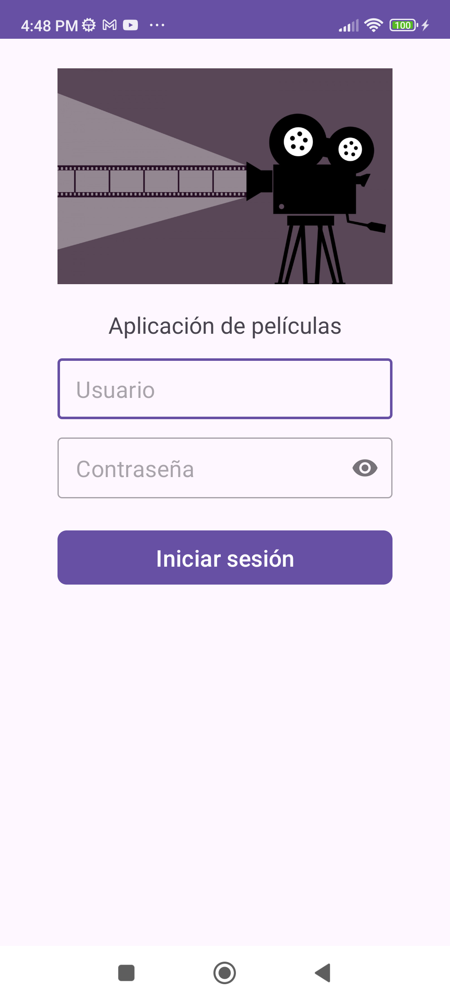
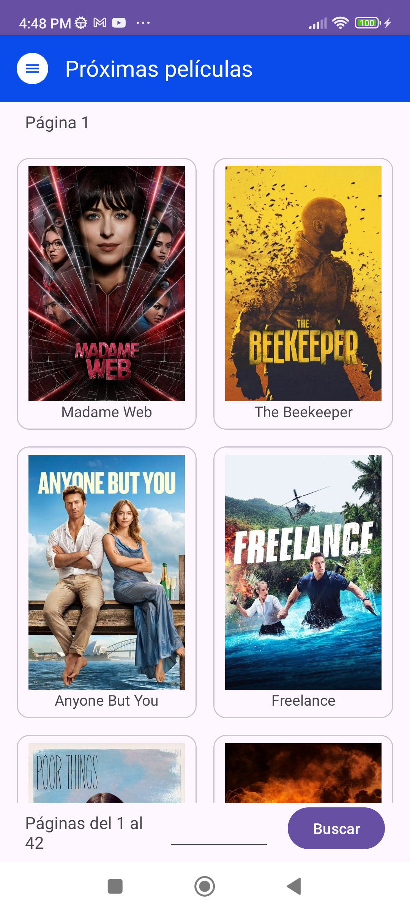
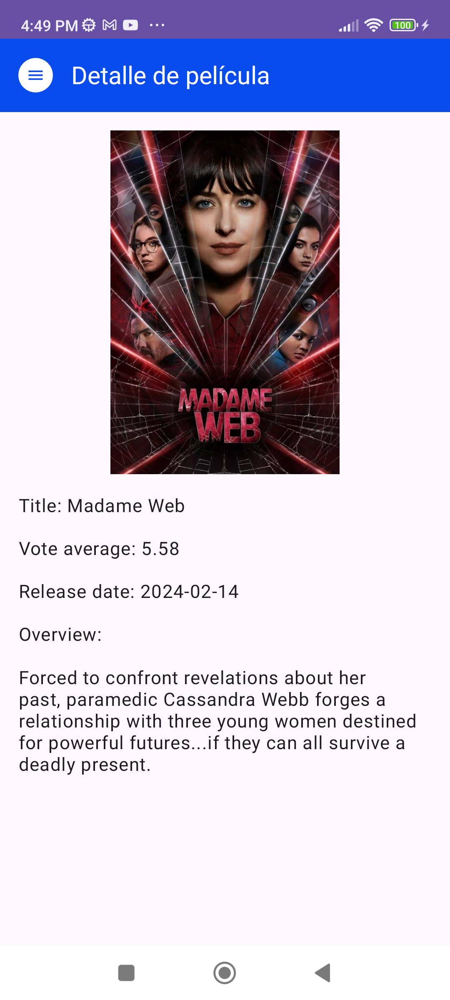
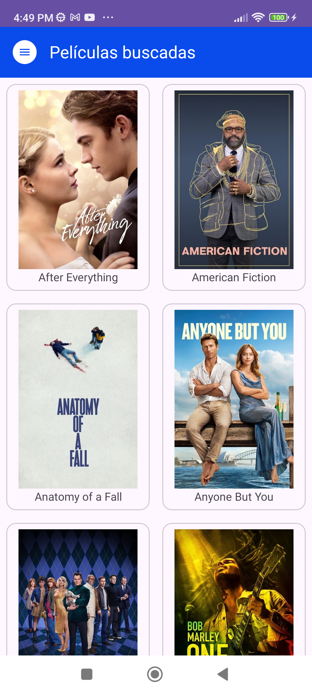

# Desafío MovieApp

Desafío Android que consiste en una aplicación de películas. 

El aplicativo se inicia con el Splash donde se muestra una imagen de película cargando que te dirige a la pantalla del login para que inicies sesión y te lleva a la sección "Próximas películas" donde te muestra las películas actuales con una paginación de 20 películas por página, en la parte inferior hay una caja de texto para que puedas ingresar el número de página que deseas buscar y un botón buscar para redirigirte a la página que quieras. 

En la sección "Próximas películas" en la página que has elegido puedes darle click a una película y se guarda automáticamente en la pantalla "Películas buscadas". 

En la sección "Películas buscadas" se muestran todas las películas que has guardado de la sección "Próximas películas" y las puedes ver online y offline. 

Finalmente tienes una opción en el menú para cerrar sesión.

## Arquitectura Model-View-ViewModel

La aplicación se desarrolló con lenguaje Kotlin y la arquitectura Model-View-ViewModel.

Model

Representa la parte de datos en los cuales se almacenan los datos que son traídos desde el servicio web.

View

Representa la parte de la vista de la aplicación. Las partes de la vista se suscriben al ViewModel y este les dirá como actuar.

ViewModel

Es la conexión entre el modelo y la vista. Las vistas se enlazan a sus respectivos ViewModels y al percatarse que el modelo ha sido modificado lo notificarán a la vista.

## Clean Architecture

La arquitectura limpia (Clean Architecture) es un enfoque para diseñar sistemas de software que se centra en la separación de preocupaciones y la independencia de las capas. En el contexto de Android, Clean Architecture se puede implementar dividiendo la aplicación en tres capas principales: presentación (ui), dominio (domain) y datos (data).

- Capa de Presentación (Presentation Layer): Esta capa se encuentra en la parte superior de la arquitectura y es responsable de la lógica relacionada con la interfaz de usuario (UI). Incluye Activities, Fragments, ViewModels, y cualquier otra clase relacionada con la presentación de la interfaz de usuario. Esta capa no debe contener lógica de negocio o acceso directo a la capa de datos, sino que actúa principalmente como un intermediario entre la interfaz de usuario y la lógica de negocio.

- Capa de Dominio (Domain Layer): Esta capa contiene la lógica de negocio principal de la aplicación. Es independiente de la capa de presentación y de la capa de datos, lo que facilita la reutilización del código y la portabilidad del negocio a través de diferentes plataformas. Incluye entidades de dominio, casos de uso (use cases) y cualquier otra lógica de negocio que no dependa de detalles de implementación.

- Capa de Datos (Data Layer): Esta capa se encarga de interactuar con las fuentes de datos, como bases de datos, servicios web, archivos locales, etc. Contiene repositorios, que actúan como abstracciones de las fuentes de datos y proporcionan métodos para acceder y manipular los datos. Es responsable de convertir los datos en un formato que sea adecuado para su uso por la capa de dominio, y viceversa. 

La comunicación entre estas capas sigue un flujo unidireccional, donde la capa de presentación solicita acciones al caso de uso correspondiente en la capa de dominio, que a su vez se comunica con los repositorios en la capa de datos para obtener o manipular los datos necesarios. Los resultados se devuelven a través del mismo flujo, asegurando un desacoplamiento y una separación clara de responsabilidades entre las diferentes capas.

## Bibliotecas

- Retrofit: Para las llamadas a los servicios de The Movie Database.
- Hilt: Para inyección de dependencias.
- Material Design: Para el diseño de las pantallas.
- Glide: Para mostrar las imágenes de las películas en el listado y en el detalle de la película.
- ViewBinding: Para vincular las clases Kotlin con las vistas XML en el diseño.
- Lottie: Para animaciones cuando la aplicación está cargando.
- Navigation: Para navegar entre los destinos de la aplicación
- Hamcrest: Para hacer las aserciones de las pruebas unitarias.
- Lifecycle: El ciclo de vida de una actividad o fragmento en Android se refiere al conjunto de estados por los que pasa la instancia de la actividad o fragmento durante su existencia.
- Junit: En las pruebas unitarias para las anotaciones @Test, @Before y @BeforeClass.
- Mockk: Para los test unitarios.
- SharedPreferences: Para el guardado de las preferencias en el celular.
- Room: Para el guardado de películas cada vez que se le hace click a una.
- Corrutinas: Para hacer las tareas del aplicativo(llamadas a internet, llamadas a base de datos, etc), sin bloquear el hilo principal.
- Room: Como gestor de base de datos para guardar las películas.

## Pantallazos

1. Login

 

2. Próximas películas

 

3. Detalle película

 

4. PeliculasBuscadas

 

5. Compartir

 

## Apk

El apk se encuentra en la raíz --> AndroidChallenge.apk

## Luis Miguel Casas.